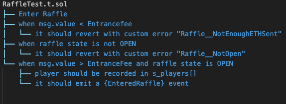
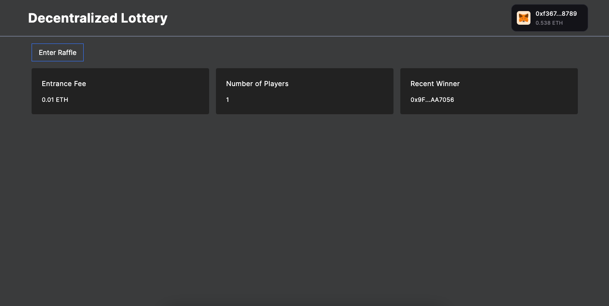

# Foundry Smart Contract Lottery

## About

Players can enter the raffle by paying in ETH and a random winner will be picked by chainlink nodes.

## Workflow



-   [Checkout the Complete Workflow](./test/unit/RaffleTest.tree)

## Test

```sh
forge test
```

| File                      | % Lines         | % Statements    | % Branches   | % Funcs         |
| ------------------------- | --------------- | --------------- | ------------ | --------------- |
| script/DeployRaffle.s.sol | 100.00% (17/17) | 100.00% (21/21) | 50.00% (2/4) | 100.00% (1/1)   |
| src/Raffle.sol            | 100.00% (36/36) | 100.00% (45/45) | 87.50% (7/8) | 100.00% (10/10) |

or

```sh
forge test --rpc-url <RPC_URL>
```

### Test Coverage

```sh
forge coverage
```

```sh
forge coverage --report debug > coverage.txt
```

-   To generate lcov report

```sh
make generateTestReport
```

## Deploy

This will default to your local node. You need to have it running in another terminal in order for it to deploy.

```sh
make deployToAnvil
```

## Deployment to a testnet or mainnet

1. Setup environment variables

-   You'll want to set your `SEPOLIA_RPC_URL` in environment variables. You can add them to a `.env` file, similar to what you see in `.env.example`.

2. Use wallet options to Encrypt Private Keys

-   [Private Key Encryption](https://github.com/allwin199/foundry-fundamendals/blob/main/DeploymentDetails.md)

Optionally, add your `ETHERSCAN_API_KEY` if you want to verify your contract on [Etherscan](https://etherscan.io/).

### Get testnet ETH

Head over to [faucets.chain.link](https://faucets.chain.link/) and get some testnet ETH. You should see the ETH show up in your metamask.

### Deploy

```sh
make deployToSepolia
```

This will setup a ChainlinkVRF Subscription for you. If you already have one, update it in the `scripts/HelperConfig.s.sol` file. It will also automatically add your contract as a consumer.

### Register a Chainlink Automation Upkeep

-   [Documentation](https://docs.chain.link/chainlink-automation/compatible-contracts)

-   Go to [automation.chain.link](https://automation.chain.link/new) and register a new upkeep. Choose `Custom logic` as your trigger mechanism for automation.

## Estimate gas

You can estimate how much gas things cost by running:

```sh
forge snapshot
```

And you'll see an output file called `.gas-snapshot`

---

## Demo

[Raffle front-end](https://raffle-frontend-new.vercel.app/)  
[Github](https://github.com/allwin199/raffle-frontend)



# Thank you :)
